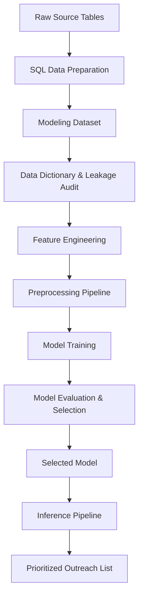

# Customer Retention Analytics Platform

A production-oriented machine learning platform that predicts voluntary customer churn for a telecom provider (ConnectTel Communications, a fictional client) and generates a prioritized list of at-risk customers with supporting explanations for the retention team to act on — built to demonstrate production-oriented Applied Machine Learning engineering rather than focusing solely on maximizing model accuracy.

## Repository Guide

This repository is organized to support readers with different levels of interest, from a quick overview to a detailed engineering review.

| Reader | Time | Path |
|---|---|---|
| **Recruiter / skimmer** | 5 min | This README: problem → architecture diagram → results → limitations |
| **Hiring manager / engineer** | 30 min | README → `sql/` folder → `tests/` folder → one ADR of your choice in `docs/adr/` |
| **Deep reviewer / interviewer prep** | 2–3 hrs | README → all ADRs in `docs/adr/` → `docs/` folder → source code in `src/retention_platform/` |

**Note on planning documentation:** This project's planning documents (business, data, and system design) are kept in a separate private planning repository, not duplicated here — a decision recorded in [ADR-0002](docs/adr/0002-exclude-planning-docs-from-public-repo.md).

## Architecture

The diagram below shows the planned end-to-end data flow, from raw source tables to the business-facing output. Each stage will become a runnable pipeline stage in `src/retention_platform/`.



## Key Design Decisions

A few of the engineering decisions behind this repository, each recorded as an Architecture Decision Record (ADR) with full context and alternatives considered:

- **Python 3.12** was standardized on to ensure compatibility with XGBoost and the broader ML ecosystem — [ADR-0001](docs/adr/0001-python-version.md)
- **Planning documents are kept in a private planning repository**, separate from this public codebase, to keep this repository focused on the implemented system — [ADR-0002](docs/adr/0002-exclude-planning-docs-from-public-repo.md)
- **`uv` is used for environment and dependency management**, giving a single-command, reproducible setup — [ADR-0003](docs/adr/0003-use-uv.md)

More Architecture Decision Records (ADRs) will be added as the project evolves, documenting significant engineering decisions throughout the implementation.

## How to Reproduce

**Prerequisites:** Python 3.12 and [`uv`](https://docs.astral.sh/uv/) installed.

Clone the repository and set up the environment:

```bash
git clone https://github.com/AmishaTiwari/customer-retention-analytics-platform.git
cd customer-retention-analytics-platform
uv sync --extra dev
```

`uv` automatically creates and manages the project's virtual environment — there is no separate manual environment setup step. This command creates the environment, installs the package in editable mode, and installs all development dependencies (see [ADR-0003](docs/adr/0003-use-uv.md)).

As additional pipeline stages are implemented, this section will expand to include a single end-to-end reproduction command (`make reproduce`) for the complete workflow.

## Results

*This section will be populated after the training and evaluation pipeline has been implemented.*

It will include the headline results comparing candidate models — the business heuristic baseline, Logistic Regression, Random Forest, and XGBoost — against the project's primary evaluation metrics (Precision@K, Lift@K, PR-AUC, and probability calibration), along with:

- A gain/decile chart
- A reliability curve
- A model comparison table

Results will be reported alongside the business assumptions used to compute them (for example, the configured value of **K**), presented with their caveats attached rather than in a separate limitations section.

## Limitations & Activated Fallbacks

*This section will be populated after data preparation and model development are complete, documenting only the limitations and activated fallbacks that were actually encountered during implementation.*

Known candidate limitations, based on the dataset selected for this project, include:

- The data represents a single snapshot rather than true longitudinal customer history, so temporal validation is out of scope.
- The churn label may be an approximation of voluntary churn rather than a purpose-built distinction between voluntary and involuntary churn.

This section will confirm which of these applied, document any others discovered during implementation, and state how each was addressed.

## Production Gaps

This project deliberately excludes several capabilities a production-grade deployment would require, in order to stay focused on core Applied Machine Learning engineering practices. Their absence is a scope decision, not an oversight.

- **CI/CD** — Tests currently run locally via `make test`. A production version would run this suite automatically on every push, likely via GitHub Actions.
- **Containerization (Docker)** — The project runs in a local, `uv`-managed environment. A production version would package the application in a container for consistent deployment across environments.
- **Cloud deployment** — The platform runs entirely locally. A production version would deploy the batch scoring job to a cloud environment (e.g., a scheduled cloud function or managed compute service).
- **Model monitoring & drift detection** — Model performance is evaluated once, offline, on a holdout test set. A production version would continuously monitor prediction quality and input data drift over time.
- **Feature store** — Features are computed directly within the pipeline. A production version serving multiple models or real-time use cases might centralize feature computation in a feature store.
- **Model registry / orchestration (e.g., MLflow Server, Airflow)** — Experiment tracking here is file-based, and pipeline stages run via the Makefile. A production version might adopt a managed registry and an orchestrator for scheduling and dependency management.

Each of these represents a natural next step if this platform were to move from a portfolio project toward an actual production system.

## Repository Map

```
customer-retention-analytics-platform/
│
├── README.md                # This file
├── pyproject.toml           # Package metadata and dependencies
├── Makefile                 # Project entry points and developer workflows
├── config/                  # Single configuration file (paths, seed, business parameters, tuning settings)
├── data/                    # Raw, interim, and processed data (git-ignored; rebuilt by pipeline)
├── sql/                     # Versioned SQL, numbered by execution order
├── src/retention_platform/  # Installable Python package (data, features, pipeline, models, evaluation, inference)
├── notebooks/               # Bounded exploratory work (dataset understanding, EDA only)
├── artifacts/               # Model bundles, evaluation metrics, and per-run experiment tracking
├── outputs/                 # Business-facing outputs (Prioritized Outreach List, economics summary)
├── docs/                    # Architecture Decision Records (ADRs) and implementation documentation
└── tests/                   # pytest suite mirroring the package structure
```
